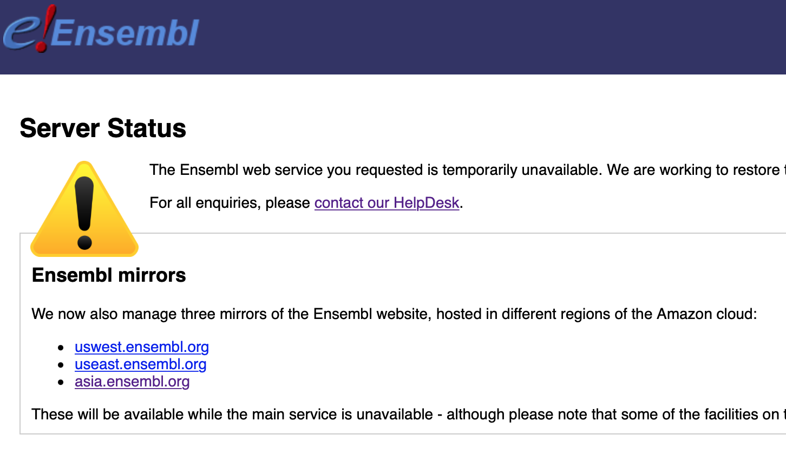

```{css, echo=FALSE}
pre {
  white-space: pre-wrap;
}
.nowrap pre{
  white-space: nowrap;
}
.tiny .remark-code {
  font-size: 60% !important;
}
```

```{r, setup, include=FALSE}
# Set working directory
knitr::opts_knit$set(root.dir = '~/project/notebook-test/herring_project_presentation/herring-selective-sweep-presentation/')

# Set paths to files
eigenvec_path = 'data/chr4_pca.eigenvec'
eigenval_path = 'data/chr4_pca.eigenval'

atlantic_freq_path = 'data/chr4_atlantic.frq'
baltic_freq_path = 'data/chr4_baltic.frq'

atlantic_het_path = 'data/chr4_atlantic.hwe'
baltic_het_path = 'data/chr4_baltic.hwe'

annotations_path = 'data/original_already_annotated.txt'

library("biomaRt")
library("tidyverse")
library("vroom")
library("ggrepel")

# Set cache TRUE or FALSE 
knitr::opts_chunk$set(cache = FALSE)

# Don't change
hook_source <- knitr::knit_hooks$get('source')
knitr::knit_hooks$set(source = function(x, options) {
  x <- stringr::str_replace(x, "^[[:blank:]]?([^*].+?)[[:blank:]]*#<<[[:blank:]]*$", "*\\1")
  hook_source(x, options)
})
```

```{r init, include=F, echo=F, message=F}
# Check you're in the right directory, change include to TRUE to output
# getwd()
```

# Background 

- The Baltic Sea was formed approximately 15,000 years ago, and following its creation the Atlantic herring migrated into the new habitat causing a bottleneck of their gene pool and forming a population that would become the subspecies Baltic herring. 

- This event caused a selective sweep to take place in the new population.

- Selective Sweep = The process of a beneficial mutation increasing in frequency and becoming fixed, resulting in less genetic variation in the genome around the mutation.

- Selective sweeps can be identified by changes in heterozygosity and increases in allele frequency in regions.

- By determining the presence of selective sweeps in the chromosome, it should be possible to discover the genes that had to mutate (and then became “fixed” in the population) in order to allow the herring to adapt to their new environment. 
---

# Aim

Locate the peak and range of a selective sweep of interest on chromosome 4 in the genome of the studied baltic herring samples, and find out which gene/genes that have played a key role in the development of the new herring subspecies. 

---

# Methods Overview

- Received a VCF file with genomic data from multiple species/locations of herring samples. Including Atlantic, Baltic, Sea of Japan, White Sea, Pacific herring. 

- Extract all data related to chromosome 4 from the original file in order to have a file of a more manageable size to work with. 

- Used PCA analysis to study the provided data to better understand population structure

- Through a filtering process remove unwanted populations and samples from the study

- Calculate the heterozygosity of alleles along the chromosome

- Filter individuals who have a missingness value of 1

- Calculate the allele frequency and delta allele frequency across the chromosome

- Determine the peak and range of the selective sweep of interest    

- Annotate SNPs of interest 

---

# Check population structure 

Extract chromosome 4

```{bash, eval=FALSE, echo=T}
vcftools --gzvcf data/Ch_v2.0.2_79_ind_snpEff.vcf.gz 
--chr chr4 --recode --out data/chr4
```

Principal component analysis with PLINK

```{bash, eval=F, echo=T}
plink --vcf data/Ch_v2.0.2_79_ind_snpEff_chr4.vcf 
--double-id  --pca tabs --out data/chr4_pca
```

???

Then read output into R and plot 

---

# Check population structure

Read the files into R

.tiny[
```{r, message=FALSE, echo=TRUE}
library(tidyverse)

# Read files
eigenvec <- read_tsv(file = eigenvec_path, col_names = F)
eigenval <- scan(file = eigenval_path) 

# Set eigenvec column names
colnames(eigenvec) <- c("ID1", "ID2", 
                        paste0("PC", 1:(ncol(eigenvec)-2)))

# List areas
areas <- c("Atlantic", "Baltic", "SeaofJapan", "BarentsSea", "WhiteSea", "Pacific")

# extract strings from ID1, if it matches any of the ares, put corresponding value in area
eigenvec <- eigenvec %>% 
  mutate(Area = str_extract(ID1, paste(areas, collapse = "|"))) #<<
```

Calculate variance and create label

```{r, variance-label, echo=T}
variance_label <- function(pc, var_vector) {
  # keep PC number
  pc <- as.numeric(sub("\\D+", "", pc))
  # Calculate variance
  variance <- var_vector[pc] / sum(var_vector)
  # Construct label
  label <- paste0("PC", pc, " (", round(variance*100, 2), "%)")
  # Return the label 
  return(label)
}
```
]

---

# PCA Plot

```{r, fig.height=4, dev='png', echo=T}
ggplot(eigenvec, aes(x = PC1, y = PC2, color = Area)) +
  # minor amount of jitter to make the baltic samples visible
  geom_jitter(width = 0.01, height = 0.03, alpha = 0.5) +
  xlab(variance_label("PC1", eigenval)) + 
  ylab(variance_label("PC2", eigenval))
```
---
# Balsfjord herring are not Atlantic

```{r, comment='#', list-outliers}
# Filter the PCA data for the atlantic outliers 

eigenvec %>% filter(PC1 > 0 & Area == "Atlantic") %>% select(ID1)
```
---
# Allele frequencies

Get a list of the samples

```{bash, eval=F, comment='#'}
# same for baltic
bcftools query -l chr4.vcf | grep "Atlantic" | grep -v "Balsfjord" > atlantic_samples.txt

```

Output allele frequencies

```{bash, eval=F, comment='#'}
# same for baltic
vcftools --vcf chr4.vcf --keep atlantic_samples.txt --freq2 --out chr4_atlantic
```

???

Then read into R

---

# Calculate allele frequencies

```{bash, comment='#', eval=F, echo=T}
# Get sample names
bcftools query -l chr4.recode.vcf | grep "Baltic" > baltic_samples.txt
bcftools query -l chr4.recode.vcf | grep "Atlantic" | grep -v "Balsfjord" > atlantic_samples.txt

# Produce vcf-files for chr4 where atlantic and baltic are kept 
vcftools --vcf chr4.recode.vcf -keep atlantic_samples.txt --recode --out chr4_atlantic
vcftools --vcf chr4.recode.vcf -keep baltic_samples.txt --recode --out chr4_baltic

# VCFtools can be used to extract allele frequencies
vcftools --vcf data/chr4_atlantic.recode.vcf --freq2 --out chr4_atlantic
vcftools --vcf data/chr4_baltic.recode.vcf --freq2 --out chr4_baltic
```

---

# Read Allele frequencies into R

```{r, comment='#', load-allele-frequencies}
allele_column_names = c("CHROM", "POS", "N_ALLELES", "N_CHR", "A1_FREQ", "A2_FREQ")
allele_column_types = "cddddd"

#Load samples 
atlantic_raw_allele_freq <- read_tsv(file = atlantic_freq_path, skip = 1, col_names = allele_column_names, col_types = allele_column_types)

baltic_raw_allele_freq <- read_tsv(file = baltic_freq_path, skip = 1, col_names = allele_column_names, col_types = allele_column_types)
```

```{r select-allele-frequencies, comment='#'}
#Select important, add identifier
atlantic_allele_freq <- atlantic_raw_allele_freq %>% 
  select(POS, FREQ = A2_FREQ) %>% 
  mutate(ID = "Atlantic Alt Allele Freq")

baltic_allele_freq <- baltic_raw_allele_freq %>% 
  select(POS, FREQ = A2_FREQ) %>% 
  mutate(ID = "Baltic Alt Allele Freq")
```

---

# Calculate delta and window-size

```{r delta-allele-frequencies, comment='#'}
delta_allele_freq <- atlantic_allele_freq %>% select(POS)

#Calculate delta allele frequency
delta_allele_freq <- delta_allele_freq %>% 
  mutate(
    FREQ = abs(atlantic_allele_freq$FREQ - #<<
                 baltic_allele_freq$FREQ), #<< 
    ID = "Delta Allele Freq")
```

```{r combine-and-break-size, comment='#'}
# Combine data
combined_allele_freq <- rbind(atlantic_allele_freq, 
                       baltic_allele_freq, 
                       delta_allele_freq)
# Set window size
window_size = 1000 #<<

# Calculates break size based on window size 
break_size <- function(positions, window_size) {
  breaks <- (max(positions) - min(positions)) / (window_size)
  return(breaks) }
```

---
# Plot allele frequencies 

```{r, message=FALSE, warning=FALSE,fig.width=14,fig.height=5, dev='png'}
combined_allele_freq %>%
  group_by(gr = cut(POS, break_size(POS, window_size)), ID) %>% #<<
  summarize(`Position (Mb)` = mean(POS/1e6), `Mean Frequency` = mean(FREQ)) %>%
  ggplot(aes(`Position (Mb)`,`Mean Frequency`, col = ID)) + 
  geom_jitter(width = 0, height = 0.03, size = .1, alpha = .3, show.legend = FALSE) + 
  facet_wrap(~ID, ncol = 3)
```

---

# Heterozygosity 

Use VCFtools to get heterozygosity frequencies

```{bash, eval=F}
vctools --vcf chr4.vcf --keep atlantic_samples.txt --hardy --out ...
```

Read into R, calculate delta and also total observations...

---

# Heterozygosity
.tiny[
```{bash, calculate-het, eval=F, include=F}
vctools --vcf chr4_atlantic.vcf --keep data/atlantic_samples.txt --hardy --out chr4_atlantic_het
vctools --vcf chr4_atlantic.vcf --keep data/atlantic_samples.txt --hardy --out chr4_atlantic_het
```

```{r, eval = T, message=F, warning=F, echo=T}
# Load heterozygosity 
atlantic_raw_het_freq <- read_tsv(atlantic_het_path)
baltic_raw_het_freq <- read_tsv(baltic_het_path)

# Separate `OBS(HOM1/HET/HOM2)` column, calculate frequency and select important
atlantic_het_freq <- atlantic_raw_het_freq %>% 
  separate(`OBS(HOM1/HET/HOM2)`, c("OBS_HOM1", "OBS_HET", "OBS_HOM2"), convert = T) %>%
  mutate(TOT_OBS = OBS_HOM1 + OBS_HET + OBS_HOM2, #<<
         FREQ = OBS_HET / TOT_OBS, #<<
         ID = "Atlantic Obs Het Freq") %>%
  select(POS, FREQ, ID, TOT_OBS)

baltic_het_freq <- baltic_raw_het_freq %>% 
  separate(`OBS(HOM1/HET/HOM2)`, c("OBS_HOM1", "OBS_HET", "OBS_HOM2"), convert = T) %>%
  mutate(TOT_OBS = OBS_HOM1 + OBS_HET + OBS_HOM2, 
         FREQ = OBS_HET / TOT_OBS,
         ID = "Baltic Obs Het Freq") %>%
  select(POS, FREQ, ID, TOT_OBS)

# Initialize delta df with POS
delta_het_freq <- atlantic_het_freq %>% select(POS)

# Calculate delta 
delta_het_freq <- delta_het_freq %>% 
  mutate(FREQ = abs(atlantic_het_freq$FREQ - baltic_het_freq$FREQ), 
         ID = "Delta Obs Het Freq")

atlantic_baltic_het_freq <- rbind(atlantic_het_freq, baltic_het_freq)
```
]

---

# Missing observations 

```{r, missingness-plot, message=F, fig.height=4, dev='png'}
atlantic_baltic_het_freq %>%
  group_by(gr = cut(POS, break_size(POS, 1e5)), ID) %>%
  summarize(`Position (Mb)` = mean(POS/1e6), `Mean missingness` = mean(1-TOT_OBS/max(TOT_OBS))) %>%
  ggplot(aes(`Position (Mb)`,`Mean missingness`, col = ID)) + 
  geom_line()
```

---

# Filter the data

```{r, comment='#', filter-missingness}
# Choose a filter threshold, % of max
filter_threshold = 1

# Keep positions 
positions_to_keep <- inner_join(atlantic_het_freq, baltic_het_freq, by = "POS") %>%
  filter(
    TOT_OBS.x >= filter_threshold * max(TOT_OBS.x) & #<<
    TOT_OBS.y >= filter_threshold * max(TOT_OBS.y)   #<<
    ) %>% 
  select(POS)
```

```{r, remove-tot-obs, comment='#', echo=F}
# Remove the TOT_OBS column to be able to combine with delta_het_freq and plot without changing the code
atlantic_het_freq2 <- atlantic_het_freq %>% select(POS, FREQ, ID)
baltic_het_freq2 <- baltic_het_freq %>% select(POS, FREQ, ID)
```

---

# After filtering

```{r, message=FALSE, warning=FALSE,fig.width=14,fig.height=5, dev='png'}
combined_allele_freq %>%
  filter(POS %in% positions_to_keep$POS) %>% #<<
  group_by(gr = cut(POS, break_size(POS, window_size)), ID) %>% 
  summarize(`Position (Mb)` = mean(POS/1e6), `Mean Frequency` = mean(FREQ)) %>%
  ggplot(aes(`Position (Mb)`,`Mean Frequency`, col = ID)) + 
  geom_jitter(width = 0, height = 0.03, size = .1, alpha = .3) + 
  facet_wrap(~ID, ncol = 3)
```

???

Mention here the delta-freq peak

---

# Sweep region 

```{r, message=FALSE, echo=FALSE, warning=FALSE, dev='png'}
combined_allele_freq %>%
  filter(POS %in% positions_to_keep$POS) %>% 
  filter(ID == "Delta Allele Freq") %>%
  filter(between(POS, 0.9e7, 1.4e7)) %>% #<<
  mutate(`Position (Mb)` = POS/1e6, `Frequency` = FREQ) %>%
  ggplot(aes(`Position (Mb)`,`Frequency`)) + 
  geom_jitter(width = 0, height = 0, size = .3, alpha = 1, show.legend = FALSE ) + 
  ggtitle("Delta Allele Freq")
```

---

# Annotation

```{bash bcftools-ann, eval=F, echo=T}
# To get the annotations from the VCF-file
bcftools query -f "%POS\t%ANN\n" chr4.vcf > output.txt
```

```{r, annotate-function-has-to-be-here-for-code-to-work, comment='#', eval=T, echo=F}

# The function has to be here for the code to be able to run,
# But we don't want to display it, so I added a second code block,
# Displaying the code on the next slide
annotate_positions <- function(input_df, annotation_df) {
  
  # Filter positions which should be annotated 
  filtered_annotations <- annotation_df %>%   
    filter(POS %in% input_df$POS)
  
  # This info can be found in the VCF file 
  snpEff_column_names <- c("Allele","Annotation","Annotation_Impact","Gene_Name","Gene_ID","Feature_Type","Feature_ID","Transcript_BioType","Rank","HGVS.c","HGVS.p","cDNA.pos / cDNA.length","CDS.pos / CDS.length","AA.pos / AA.length","Distance","ERRORS / WARNINGS / INFO")   
  
  untangled_annotations <- filtered_annotations %>%
    mutate(ANN = str_split(ANN, ",")) %>%         # Split the ANN column into a list of annotations
    unnest(ANN) %>%                               # create rows for each position - annotation pair
    group_by(POS) %>%                             # group by position
    mutate(Annotation_ID = seq_along(POS), 
           .after = POS) %>%                      # assign a number to each annotation
    ungroup() %>%                                 # ungroup the values again 
    separate(ANN, into = snpEff_column_names,     # separate the ANN column
             sep = "\\|")                         # into columns based on SnpEff information
  
  # join annotations to input df by position
  output_df <- inner_join(input_df, untangled_annotations, by = "POS")  
  
  return(output_df)
}
```

```{r read-annotations-filter-positions, comment='#', eval=T, message=F}
# Reads the annotation file really really fast 
library(vroom) 

annotation <- vroom(annotations_path, delim = "\t", col_names = c("POS", "ANN"))

# Annotate delta frequencies
annotated_positions <- delta_allele_freq %>% 
  # In the approximate region
  filter(between(POS, 1e7, 1.3e7)) %>% #<< 
  # With a high delta freq
  filter(FREQ > 0.5) %>% #<<   
  # Keep only SNPs with good data
  filter(POS %in% positions_to_keep$POS) %>% #<<
  # Run the annotation function
  annotate_positions(annotation) #<<         
```

???

I could take the annotations parts maybe? (and more if needed)

---

# annotate_positions()

.tiny[
```{r, annotate-function-displayed-in-presentation, comment='#', eval = T, message=F}
annotate_positions <- function(input_df, annotation_df) {
  
  # Filter positions which should be annotated 
  filtered_annotations <- annotation_df %>%   
    filter(POS %in% input_df$POS)
  
  # This info can be found in the VCF file 
  snpEff_column_names <- c("Allele","Annotation","Annotation_Impact","Gene_Name","Gene_ID",
                           "Feature_Type","Feature_ID","Transcript_BioType","Rank",
                           "HGVS.c","HGVS.p","cDNA.pos / cDNA.length","CDS.pos / CDS.length",
                           "AA.pos / AA.length","Distance","ERRORS / WARNINGS / INFO")   
  
  untangled_annotations <- filtered_annotations %>%
    mutate(ANN = str_split(ANN, ",")) %>%         # Split the ANN column into a list of annotations
    unnest(ANN) %>%                               # create rows for each position - annotation pair
    group_by(POS) %>%                             # group by position
    mutate(Annotation_ID = seq_along(POS), .after = POS) %>% # assign a number to each annotation
    ungroup() %>%                                 # ungroup the values again 
    separate(ANN, into = snpEff_column_names,     # separate the ANN column
             sep = "\\|")                         # into columns based on SnpEff information
  
  # Add annotations to input dataframe 
  output_df <- inner_join(input_df, untangled_annotations, by = "POS") 
  
  return(output_df)
}
```
]

???

I could take the annotations parts maybe? (and more if needed)

---

# Annotations

Before
.nowrap.tiny[
```{r}
delta_allele_freq %>% print(n = 4)
```
]
After
.nowrap.tiny[
```{r}
annotated_positions %>% print(n = 4)
```
]

---

# Filter the output

.tiny[
```{r}
# Can then filter what we want
annotated_positions %>% group_by(Gene_ID) %>%
  filter(Feature_Type == "transcript") %>%
  select(Gene_ID, POS, FREQ) %>% unique() %>%
  summarize(mean.POS = as.integer(mean(POS)), mean.FREQ = mean(FREQ))
```
]

???

I could take the annotations parts maybe? (and more if needed)

---

```{r, fix-for-biomart-not-working, eval=T, echo=F, message=F}
# Set eval to true if you dont want to run the biomaRt code
# The biomaRt code chunk then needs to be set to eval=F
# And also comment out the labels part of the plot which is set by biomaRt
# Alternatively, change the label from extrernal_gene_name (previously zfin_id_symbol) to Gene_ID. 

annotated_gene_names <- annotated_positions %>% group_by(Gene_ID) %>%                        # Group by Gene_ID
  filter(Feature_Type == "transcript" &        # Filter for transcripts
        Annotation != "intron_variant") %>%    # Remove intron_variants (remove "double-ids")
  select(POS, FREQ, Gene_ID, ID) %>%           # Select columns to keep 
  unique() %>%                                 # Don't let multiple transcripts affect the means
  summarize(mean.pos = mean(POS),              # Summarize mean position and frequency
            mean.freq = mean(FREQ), 
            Gene_ID, ID) %>% 
  unique()                    
```

# biomaRt

Used biomaRt to get gene names for each Gene ID

.tiny[
```{r biomart, eval=F, comment='#', message=F, warning=F}
# A bug in biomaRt overwrites dplyr::select, workaround is to unload dplyr, then load it _after_ biomaRt
#detach("package:dplyr")
#library(biomaRt)
#library(dplyr)

# connect to the herring database
ensembl = useMart("ensembl",dataset="charengus_gene_ensembl")

annotated_gene_names <- annotated_positions %>%            # Take our annotated positions
  group_by(Gene_ID) %>%                        # Group by Gene_ID
  filter(Feature_Type == "transcript" &        # Filter for transcripts
        Annotation != "intron_variant") %>%    # Remove intron_variants (remove "double-ids")
  select(POS, FREQ, Gene_ID, ID) %>%           # Select columns to keep 
  unique() %>%                                 # Don't let multiple transcripts affect the means
  summarize(mean.pos = mean(POS),              # Summarize mean position and frequency
            mean.freq = mean(FREQ), 
            Gene_ID, ID) %>% 
  unique() %>%                                 # keep only unique rows
  mutate(getBM(attributes = c('ensembl_gene_id', 'external_gene_name'), # New columns from ensambl
               filters = 'ensembl_gene_id',    # where the ensembl_gene_id
               values = Gene_ID,               # equals the Gene_ID
               mart = ensembl,                 # chose mart/database
               uniqueRows = F)) %>%            # give us everything
  mutate(external_gene_name = ifelse(external_gene_name == "", NA, external_gene_name)) %>% # change "" to NA
  #na.omit() %>%                                # keep only genes with zfin_id's
  select(-ensembl_gene_id)                     # remove duplicate column
```
]

???

I could take the annotations parts maybe? (and more if needed)

---

# biomaRt

.tiny[
```{r biomart-output, eval=T}
annotated_gene_names %>% 
  #filter(external_gene_name != "NA") %>% 
  arrange(-mean.freq)
```
]

---

# biomaRt

.center.top[
]

???

I could take the annotations parts maybe? (and more if needed)

---

```{r combine-data, echo=F}
combined_data <- rbind(atlantic_allele_freq, 
                       atlantic_het_freq2, 
                       baltic_allele_freq, 
                       baltic_het_freq2, 
                       delta_allele_freq,
                       delta_het_freq)
```

# Summary plot 

```{r plot-delta-gene-names, eval=T, echo=FALSE, warning=F, message=F}
library(ggrepel)

combined_data %>%
  filter(POS %in% positions_to_keep$POS) %>%
  filter(ID == "Delta Allele Freq") %>%
  filter(between(POS, .9e7, 1.4e7)) %>%
  mutate(`Position (Mb)` = POS/1e6, `Frequency` = FREQ) %>%
  ggplot(aes(`Position (Mb)`, `Frequency`)) + 
  geom_jitter(alpha = .3, size = .3, width = 0, height = 0) + 
  geom_point(data = annotated_gene_names, aes(x = mean.pos/1e6, y = ifelse(mean.freq>0.62,mean.freq, NA), color = "top annotated genes"), alpha = 1, size = .3, show.legend = FALSE) +
  geom_text_repel(data = annotated_gene_names, 
                  aes(x = mean.pos/1e6, y = ifelse(mean.freq>0.62,mean.freq, NA), label = Gene_ID), 
                  max.overlaps = Inf, 
                 min.segment.length = 0.7,
                  segment.size = 0.3,
                  box.padding = 1,
                 na.rm = T,
                 size = 2
                  #segment.color = "red",
                  #arrow = arrow(length = unit(0.07, "inches"), type = "open")
                  ) + #+ theme(legend.position = "none") + 
  ylab("Delta Allele Freq") + 
  xlab("Chromosome 4 (Mb)")
  
```

```{r list-of-positions, include=F, eval=T}
annotated_gene_names %>% 
  arrange(-mean.freq) %>% 
  select(Gene_ID, mean.pos) %>%
  unique()
```

???

This as well (if needed)

---

# Conclusion

- Results show that only one selective sweep occurred in chromosome 4 of the baltic herring genome

- This occurred between approximately 11-12 Mb

- The genes involved in the sweep were magi1a, rho, qars1, espn, ENSCHAG00000025879, ENSCHAG00000025886 and ENSCHAG00000025895 and became fixed in the new population.

- ENSCHAG00000025879, ENSCHAG00000025886 and ENSCHAG00000025895 have poorly defined functions

- magi1a, qars1, espn are involved in signal transduction, glutamine-tRNA ligase activity and actin filament binding activity respectively. Hard to understand how their mutations will affect the population without further investigation

- rho creates G-protein-coupled photoreceptors used as light receptors

- Hill et al. showed replacement of phenylalanine by tyrosine at position 261 in rhodopsin. This allows better absorption of red wavelengths.

- The Baltic Sea has a red shifted light environment compared to the Atlantic Ocean which is blue shifted. The baltic herring fixed a mutation allowing them to see better in their new environment. 

---

class: center, top
background-image: url("https://upload.wikimedia.org/wikipedia/commons/c/c5/Clupea_harengus_Gervais.flipped.jpg")
background-size: contain

# Thanks!
